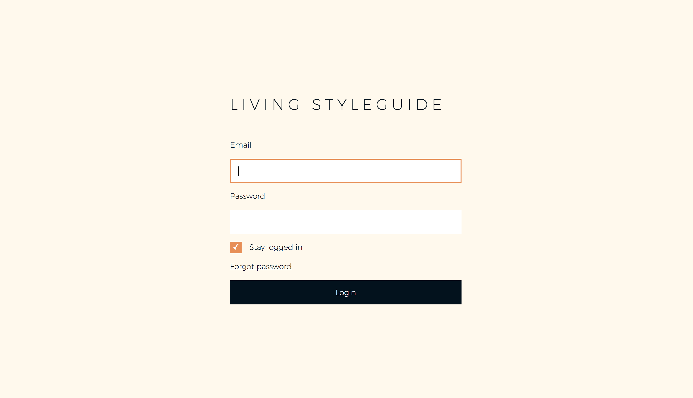
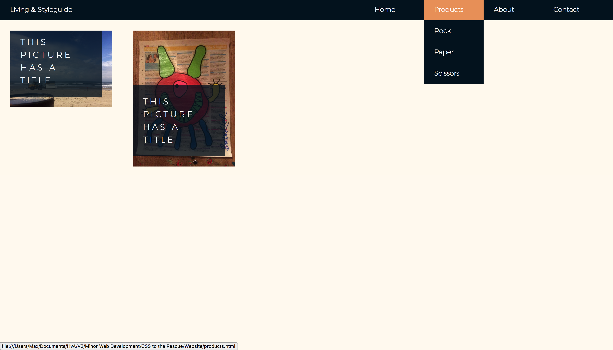
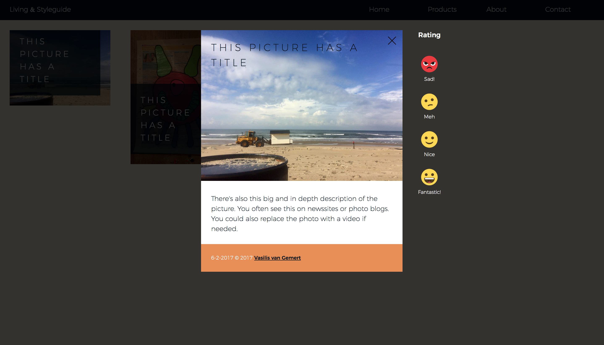
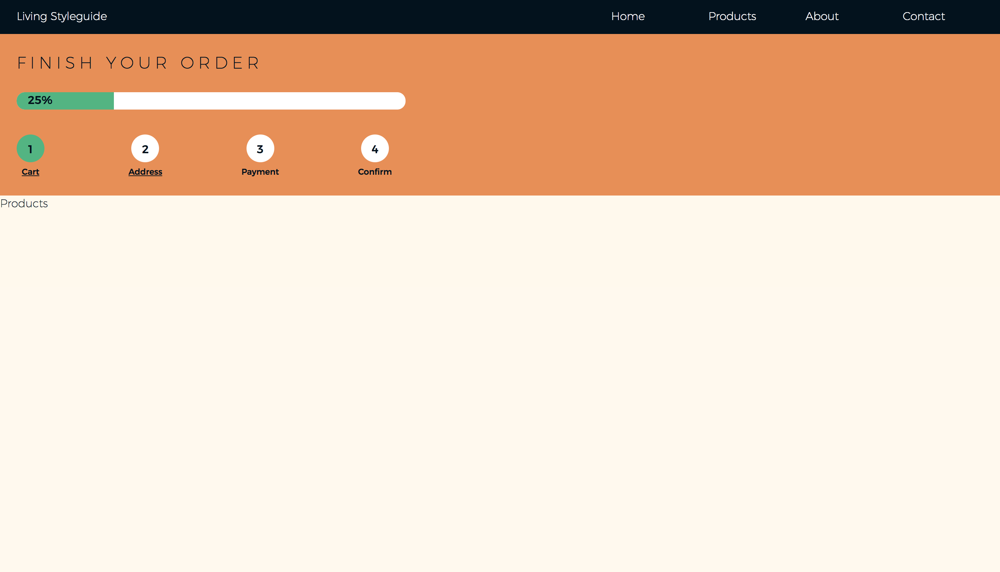
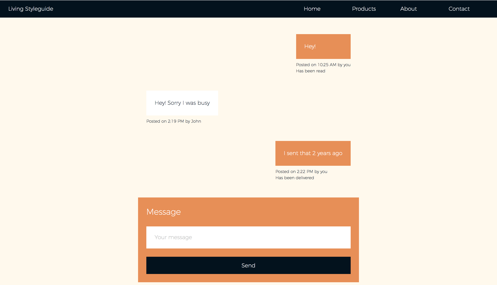

# CSS to the Rescue | Max de Vries

[Website](https://vriesm060.github.io/cssttr/website/)

Voor dit vak heb ik de componenten vormgegeven in een website. Ik was de eerste week van dit vak ziek, waardoor ik deze opdracht in een kleine 2 weken heb moeten doen. Hierdoor heb ik er niet alles uitgehaald wat ik had willen doen.

Ondanks dit heb ik de belangrijkste elementen er wel in zitten. Alle componenten zijn gestyled en responsive en de interactie is mogelijk met een toetsenbord.

Ik heb minder aandacht besteed aan de visuele vorm van de componenten en de interactie is nog niet zo pleasurable als ik zou willen.

## Componenten

### Login:

### Navigation & Media item:

### Picture with subtitle & rating:

### Step indicator:

### Chat:

## Logboek

### Week 1
Niks gedaan i.v.m. ziekte

### Week 2

*Dinsdag 13 februari:*

* Eerste opzet gemaakt voor de website.
* De navigatie gemaakt, alleen nog geen werkend submenu.

*Donderdag 15 februari:*

* Verder gewerkt aan de opzet van de website. 
* Gekeken naar kleur en typografie.
* Submenu uitklapbaar gemaakt en ook werkend gekregen via de [TAB].
* Eerste styling gemaakt voor de artikelen.
* Geëxperimenteerd met de `:target` pseudo-class om een klik te simuleren.
* CSS variabelen toegepast.

### Week 3

*Dinsdag 20 februari:*

* De lightbox met details van de afbeeldingen gemaakt.
* Hierin de component Rating verwerkt.
* De navigatie gemaakt voor de mobiel, met een hamburger menu.
* De navigatie werkbaar gemaakt voor gebruik met een toetsenbord.

*Woensdag 21 februari:*

* Het component Step Indicator gemaakt.
* Het component Chat gemaakt.
* Het component Login gemaakt.
* Alle componenten werkbaar gemaakt voor gebruik met een toetsenbord.

## Wishlist

* De website meer pleasurable maken.
* De interactie met gebruik van een toetsenbord verbeteren.
